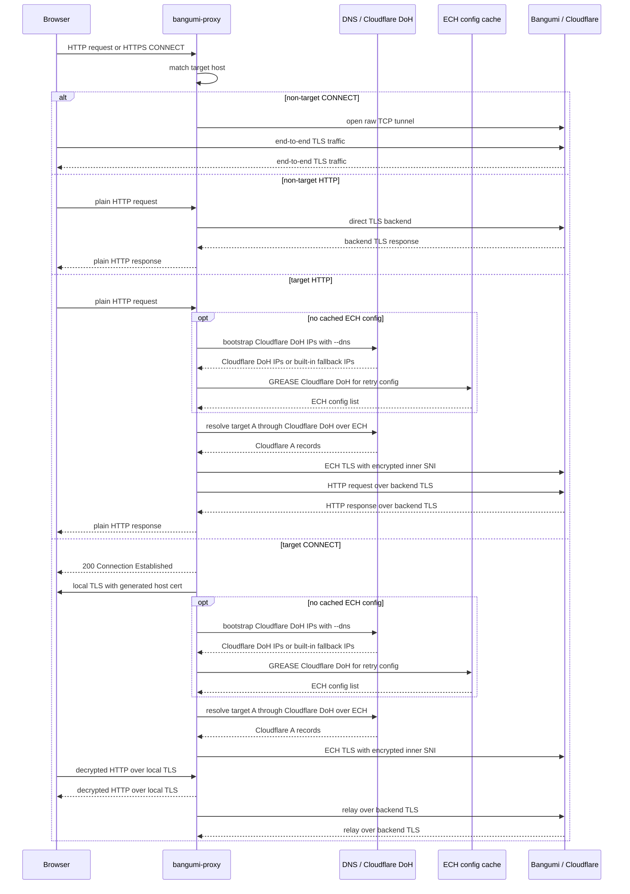

# bangumi-proxy

`bangumi-proxy` is a local HTTP/HTTPS proxy for accessing
[Bangumi](https://bgm.tv/) and related sites:

- `bgm.tv`
- `chii.in`
- `lain.bgm.tv`
- `next.bgm.tv`
- `api.bgm.tv`

It prefers **ECH (Encrypted Client Hello)** when connecting to Cloudflare
backends, which helps hide the real SNI in the TLS handshake and work around
SNI-based blocking. Point your browser's HTTP/HTTPS proxy to this program, or
use `-b` to launch a browser with the proxy already configured.

## Features

- **ECH proxying**: uses OpenSSL 4.0 ECH APIs when connecting to Cloudflare IPs
- **DNS-over-HTTPS**: supports DoH URLs and plain DNS server IPs
- **ECH DoH resolution**: resolves target A records through Cloudflare DoH over ECH
- **Targeted MITM**: generates per-host certificates only for Bangumi target domains
- **Pass-through tunneling**: non-target CONNECT requests are relayed as raw TCP tunnels
- **Custom hosts**: supports standard hosts files for non-target direct/tunnel overrides
- **Browser launch**: auto-detects Chrome, Chromium, Edge, or Firefox and configures the proxy
- **Local CA management**: generates a local CA and can install it with `--trust-ca`

## How It Works

### Request Flow

When the browser accesses a target site, traffic follows one of these paths:

```text
HTTP:
  Browser
  -> 127.0.0.1:10721 (bangumi-proxy)
  -> ECH bootstrap DNS and Cloudflare DoH over ECH
  -> ECH TLS to the remote target server
  -> bidirectional relay between browser and server

HTTPS CONNECT:
  Browser
  -> 127.0.0.1:10721 (bangumi-proxy)
  -> local MITM TLS with a generated host certificate
  -> ECH bootstrap DNS and Cloudflare DoH over ECH
  -> ECH TLS to the remote target server
  -> bidirectional relay between browser and server
```



The proxy listens on `127.0.0.1:<port>`. For each browser request, it first
checks the request type:

- Plain HTTP requests: parse `Host` and path, rebuild the request, and forward it
  through a backend TLS connection. Target hosts use ECH TLS; non-target hosts
  use direct TLS.
- HTTPS `CONNECT` requests: return `200 Connection Established`, then use local
  MITM for target hosts or raw TCP tunneling for non-target hosts.

### Target Host Matching

Target domains are defined in `src/targets.rs`:

```text
chii.in / lain.bgm.tv / bgm.tv / next.bgm.tv / api.bgm.tv
```

These domains and their subdomains use the Bangumi-specific path. Other domains
are not decrypted or modified; they are forwarded as plain TCP tunnels to the
remote `:443` endpoint.

`bangumi.tv` is intentionally not included because it is not hosted behind
Cloudflare, so the ECH path used by this proxy does not apply to that domain.

### DNS and Hosts Resolution

Target hosts use a strict ECH path:

1. Bootstrap `cloudflare-dns.com` A records with the `--dns` servers.
2. Fall back to built-in Cloudflare DoH IPs if bootstrap DNS fails.
3. Fetch a Cloudflare ECH retry config with a GREASE handshake.
4. Resolve the target A records through Cloudflare DoH over ECH.
5. Keep only Cloudflare IPs, then connect with ECH.

Target hosts do not fall back to non-ECH DNS or direct TLS. IPs and ECH config
lists are cached in memory and invalidated after connection failures.

The `--hosts` file is currently used for non-target direct TLS and raw CONNECT
tunnels. It does not override target-host ECH resolution.

### ECH Connections

ECH logic lives in `src/ech.rs` and `ech_helper.c`.

The proxy first performs a GREASE ECH handshake against Cloudflare DoH IPs and
extracts the retry config as an ECH config list. That config is cached and reused
for later backend connections. When connecting to a Bangumi backend, the proxy:

1. Uses the target host as the inner SNI
2. Uses `cloudflare-ech.com` as the outer SNI
3. Sets the ECH config list through OpenSSL 4.0
4. Connects to the resolved Cloudflare IP

The visible outer ClientHello contains the outer SNI, while the real target host
is placed in the encrypted inner ClientHello.

### HTTPS MITM and Local CA

For HTTPS `CONNECT` requests to target domains, the proxy performs local MITM:

1. Load or generate `ca.pem` and `ca-key.pem`
2. Generate a temporary certificate for the requested host
3. Establish TLS between the browser and the proxy using that certificate
4. Establish ECH TLS between the proxy and the remote target server
5. Relay decrypted HTTP data between both TLS sessions

Because of this, the local CA must be trusted before HTTPS target sites can be
used without certificate warnings:

```bash
bangumi-proxy --trust-ca
```

When launching Chromium-based browsers with `-b`, the proxy uses an isolated
temporary profile and passes `--ignore-certificate-errors` for easier testing.
For regular use, trusting the local CA is still recommended.

### Fallback Behavior

Backend connections use limited retries:

- Cloudflare DoH bootstrap uses `--dns`, then built-in Cloudflare IPs if needed
- Target DNS is queried through Cloudflare DoH over ECH only
- Target A records outside Cloudflare ranges are ignored
- ECH timeouts try the next target IP
- Other ECH failures invalidate the cached ECH config and target IPs
- Non-target requests use direct TLS or raw TCP tunnels, with `--hosts`
  overrides when present

## Installation

### Download Prebuilt Binaries

Download the package for your platform from
[GitHub Releases](https://github.com/Blacktea0/bangumi-proxy/releases).

| Platform | File |
| --- | --- |
| Linux x86_64 | `bangumi-proxy-*-linux-x86_64.tar.gz` |
| Windows x86_64 | `bangumi-proxy-*-windows-x86_64.zip` |
| macOS Intel | `bangumi-proxy-*-macos-x86_64.tar.gz` |
| macOS Apple Silicon | `bangumi-proxy-*-macos-aarch64.tar.gz` |

### Build from Source

Requirements:

- [Rust](https://rustup.rs/) stable
- [Conan 2.x](https://conan.io/)
- A C compiler: MSVC on Windows, gcc or clang on Linux/macOS

```bash
# Install Conan
pip install conan
# or
pipx install conan

# Create a temporary Conan recipe for OpenSSL 4.0
mkdir -p conan
cat > conan/conanfile.txt <<'EOF'
[requires]
openssl/4.0.1
[generators]
PkgConfigDeps
VirtualBuildEnv
VirtualRunEnv
EOF

# Install OpenSSL 4.0
conan profile detect --force

# Linux/macOS
conan install conan --build=missing -s build_type=Release

# Windows: use static CRT to match Rust MSVC defaults
conan install conan --build=missing -s build_type=Release -s compiler.runtime=static
```

Set OpenSSL environment variables on Linux/macOS:

```bash
CONAN_PKG=$(find ~/.conan2/p -path "*/p/include/openssl/ech.h" 2>/dev/null | head -1 | sed 's|/include/openssl/ech.h||')
export OPENSSL_DIR=$CONAN_PKG
export OPENSSL_INCLUDE_DIR=$CONAN_PKG/include
export OPENSSL_LIB_DIR=$CONAN_PKG/lib
export OPENSSL_STATIC=1
```

Set OpenSSL environment variables in Windows PowerShell:

```powershell
$libFile = Get-ChildItem -Path "$env:USERPROFILE\.conan2\p" -Recurse -Filter "libssl.lib" -ErrorAction SilentlyContinue | Where-Object { $_.FullName -match "\\p\\lib\\" } | Select-Object -First 1
$CONAN_PKG = $libFile.Directory.Parent.FullName
$env:OPENSSL_DIR = $CONAN_PKG
$env:OPENSSL_INCLUDE_DIR = "$CONAN_PKG\include"
$env:OPENSSL_LIB_DIR = $libFile.DirectoryName
$env:OPENSSL_STATIC = "1"
```

Build:

```bash
cargo build --release
```

## Usage

```text
bangumi-proxy [OPTIONS]

Options:
  -p, --port <PORT>        Listening port [default: 10721]
  -b, --browser            Launch browser with auto-configured proxy
  -u, --url <URL>          URL to open in browser [default: https://bgm.tv]
      --chrome [PATH]      Use Chrome (optional custom path)
      --chromium [PATH]    Use Chromium (optional custom path)
      --edge [PATH]        Use Edge (optional custom path)
      --firefox [PATH]     Use Firefox (optional custom path)
      --dns <DNS>          DoH URL or plain DNS IP, comma-separated [default: https://doh.pub/dns-query]
      --hosts <HOSTS>      Custom hosts file path for non-target direct/tunnel overrides
      --trust-ca           Install CA certificate to system trust store
```

### Quick Start

```bash
# Start the default proxy at 127.0.0.1:10721
bangumi-proxy

# Auto-detect a browser and open bgm.tv
bangumi-proxy -b

# Use a specific browser
bangumi-proxy --chrome -u https://bgm.tv
bangumi-proxy --edge -u https://bgm.tv
bangumi-proxy --firefox -u https://bgm.tv

# First-time HTTPS setup
bangumi-proxy --trust-ca
```

### Manual Browser Configuration

If you do not use `-b`, configure your browser manually:

```text
HTTP proxy:  127.0.0.1
HTTPS proxy: 127.0.0.1
Port:        10721
```

### Custom DNS

`--dns` accepts DoH URLs or plain DNS IPs. Separate multiple servers with commas:

```bash
bangumi-proxy --dns https://doh.pub/dns-query,1.1.1.1,8.8.8.8
```

### Custom Hosts

The hosts file uses the standard format and currently applies only to
non-target direct TLS and raw CONNECT tunnels:

```text
203.0.113.10 example.com www.example.com
198.51.100.20 assets.example.net
```

Start the proxy with:

```bash
bangumi-proxy --hosts ./hosts
```

Target Bangumi hosts are still resolved through Cloudflare DoH over ECH.

## Project Layout

```text
src/main.rs      Entry point, argument parsing, listener setup, browser launch
src/cli.rs       CLI flags and defaults
src/proxy.rs     HTTP/HTTPS proxy handling, CONNECT, MITM, tunnels, relay loops
src/backend.rs   Target ECH backend and non-target direct TLS backend
src/browser.rs   Browser discovery and launch arguments
src/ca.rs        Local MITM CA generation, loading, and trust installation
src/dns.rs       DoH/plain DNS bootstrap and A record parsing
src/ech.rs       ECH config caching, GREASE, and ECH TLS connections
src/hosts.rs     Custom hosts file parsing for non-target overrides
src/targets.rs   Bangumi target hosts and Cloudflare IP range matching
ech_helper.c     OpenSSL ECH GREASE helper
build.rs         Detects OpenSSL ECH headers and compiles the C helper
```

## Notes

- The proxy is intended for local use only and listens on `127.0.0.1` by default.
- Target HTTPS sites require the local CA to be trusted, otherwise browsers will
  show certificate warnings.
- `ca-key.pem` is the local CA private key. Do not upload, share, or commit it.
- OpenSSL ECH support is required. Builds fail if `openssl/ech.h` cannot be
  found through `OPENSSL_DIR` / `OPENSSL_INCLUDE_DIR` or the system OpenSSL path.

## Known Issues

- Cloudflare Turnstile challenges cannot be reliably passed through MITM TLS,
  even when the local CA is trusted. Challenge and login hosts must be tunneled
  end-to-end so the browser keeps its normal TLS session and fingerprint.

## License

MIT
